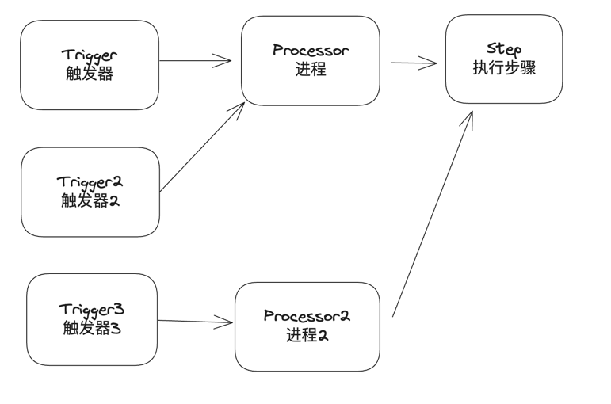

# LiuYun(流云)(WIP)
流云是一个流程引擎，它并不保证遵循BPM规则，但它的目标是足够简单和高扩展，方便定制。 

它现在还在建设中，仅完成少量代码。

所有的使用示例均放置于liuyun-test中。

## 核心概念

## TODO

### 触发器部分

| 功能          | 是否完成 |
|-------------|------|
| 定时任务触发器     |      |
| HTTP触发器     |      |
| 消息触发器       |      |

### 进程部分

| 功能     | 是否完成 |
|--------|------|
| 顺序执行进程 |      |
| 调试进程   |      |

### 节点部分

| 功能       | 是否完成 |
|----------|------|
| 日志节点     |      |
| 变量操作节点   |      |
| 输出节点     |      |
| HTTP调用节点 |      |
| 等待操作节点   |      |
| 数据节点     |      |

